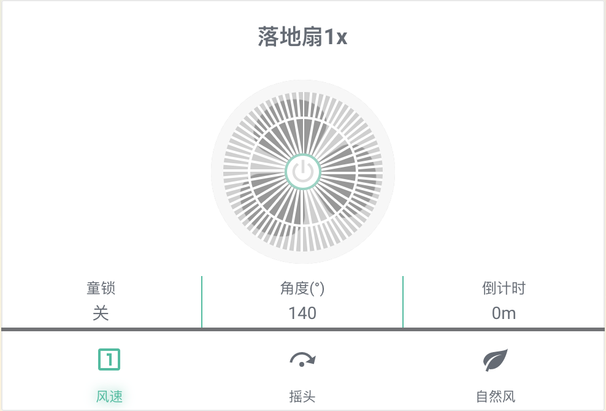
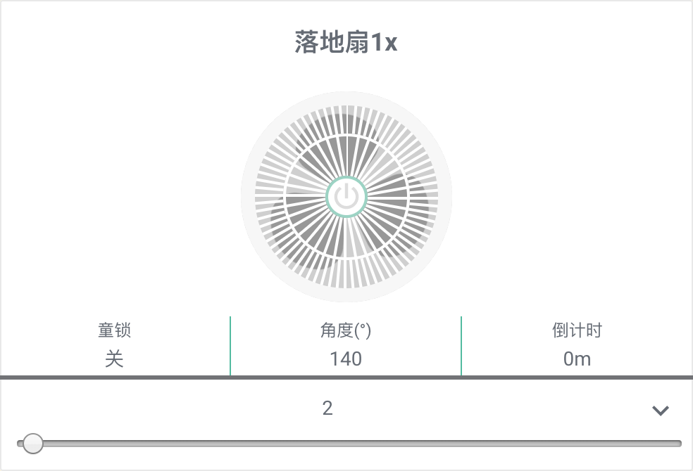
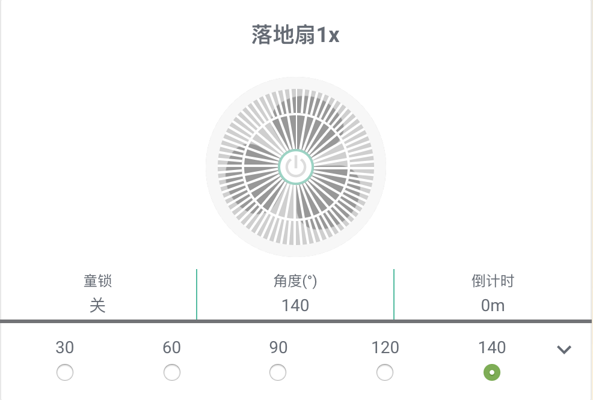

# Xiaomi Fan Lovelace Card
[](https://github.com/custom-components/hacs)

Xiaomi Smartmi Fan Lovelace card for HASS/Home Assistant.

+  Supports [HACS](https://github.com/custom-components/hacs) installation
+  Works seamlessly with the [iwzoo/xiaomi_fan](https://github.com/iwzoo/xiaomi_fan) integration
+  Animations of the fan are made purely with CSS
+  Hold to adjust fan speed 
+  Hold to adjust oscillating angle (30, 60, 90, 120, 140) degrees
+  Translation for titles

## HACS Installation
1. Navigate to HACS 
1. Choose "Frontend"
1. Choose "Custom repositories" from the top right button
1. Enter "https://github.com/iwzoo/lovelace-xiaomi-smartfan" in "Add custom repository URL", Choose "Lovelace" for "Category"
1. Find "Xiaomi smartfan Card (Smartmi Fan 1x)"  in "Frontend" and click "Install"


## Manual Installation
1. Download `smartfan-xiaomi.js`
1. Copy to `www/plugins/lovelace-xiaomi-smartfan/xiaomi-smartfan.js`
1. Add the following to your Lovelace resources
    ``` yaml
    resources:
    - url: /local/lovelace-xiaomi-smartfan/xiaomi-smartfan.js
      type: js
    ```
1. Add the following to your Lovelace config `views.cards` key
    ```yaml
    - entity: fan.entity_id
      name: Fan Name
      type: 'custom:smartfan-xiaomi'
      translate: #optional for titles in any language
        Angle: 
        Child Lock:
        Natrual:
        Off:
        On:
        Oscillate:
        Speed Level:
        Timer:
    ```
    Replace `fan.entity_id` with your fan's entity_id and `Fan Name` with any name you'd like to name your fan with


# 小米风扇1x lovelace卡片
[](https://github.com/custom-components/hacs)

HA 智米风扇 1x lovelace 卡片

+  支持 [HACS](https://github.com/custom-components/hacs) 
+  配合 [iwzoo/xiaomi_fan](https://github.com/iwzoo/xiaomi_fan) 使用
+  纯CSS 动画效果
+  长按风速按钮调整风扇速度
+  长按摆风按钮调整摆风角度(30, 60, 90, 120, 140)度
+  支持文本多语言

## HACS 安装
1. 打开HACS 
1. 选择“前端”
1. 右上角下拉菜单选择“自定义存储库”
1. “添加自定义存储库URL“ 输入 "https://github.com/iwzoo/lovelace-xiaomi-smartfan" , “类别”选择“ "Lovelace" 
1. 在前端页面找到 "Xiaomi smartfan Card (Smartmi Fan 1x)"  点击 “安装”

## Manual Installation
1. 下载 `smartfan-xiaomi.js`
1. 拷贝 到 `www/plugins/lovelace-xiaomi-smartfan/xiaomi-smartfan.js`
1. 在lovelace资源添加
    ``` yaml
    resources:
    - url: /local/lovelace-xiaomi-smartfan/xiaomi-smartfan.js
      type: js
    ```
1. 在视图卡片内添加
    ```yaml
    - entity: fan.entity_id
      name: Fan Name
      type: 'custom:smartfan-xiaomi'
      translate: #optional for titles in any language
        Angle: 
        Child Lock:
        Natrual:
        Off:
        On:
        Oscillate:
        Speed Level:
        Timer:
    ```
    替换实际的设备id `fan.entity_id`  修改名称`Fan Name`  
    
    
## Preview （预览）






## Credits
[fineemb](https://github.com/fineemb) (Original author)

[ikaruswill](https://github.com/ikaruswill/) (forked from)

[shaonianzhentan](https://github.com/shaonianzhentan/)

[花神](https://github.com/yaming116)
